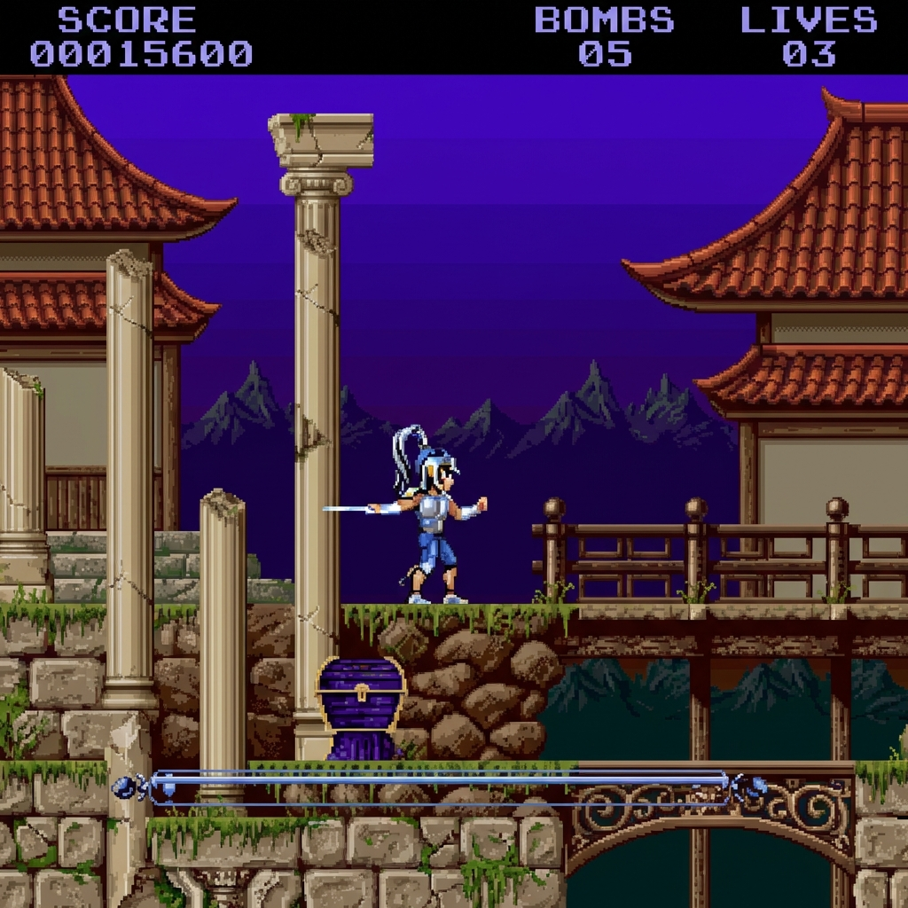

# Leander 2 (Amiga 1200 AGA)




A proof-of-concept project to develop a sequel to the classic "Leander" for the Commodore Amiga 1200 (AGA Chipset), using modern development tools.

Developed by MC using C (GCC) and automatic asset pipelines.

## 🚀 Features (So far)
- **Bare Metal C**: Direct hardware access (Copper, Blitter, custom chips) without OS overhead.
- **Modern Toolchain**: Cross-compilation via Docker (`ozzyboshi/bebbo-amiga-gcc`).
- **Asset Pipeline**: Python scripts (`tools/convert_assets.py`) automatically convert PNG images into Amiga bitplane format (Interleaved) and generate C headers.
- **Copper Backgrounds**: Custom Copper lists to display high-color backgrounds.

## 🛠 Prerequisites

### 1. Docker
Used for cross-compilation.
```bash
sudo apt install docker.io
sudo docker pull ozzyboshi/bebbo-amiga-gcc
```

### 2. Python 3 + Pillow
Used for asset conversion.
```bash
python3 -m venv venv
./venv/bin/pip install Pillow
```

### 3. FS-UAE (Emulator)
Used for testing the game.
```bash
sudo apt install fs-uae
```
*Note: You will need your own Kickstart ROMs (kick31.rom) in the project root or configured in FS-UAE.*

## 🏗 Building & Running

Simply run:

```bash
make run
```

This command will:
1.  Convert assets (PNG -> Amiga C Headers) if changed.
2.  Compile the C code using Docker.
3.  Fix file permissions.
4.  Launch FS-UAE with the game.

## 📂 Project Structure

- `src/`: Source code (`main.c`, hardware definitions).
- `assets/`: Graphics files. `test_bg.png` is ground truth; headers are generated.
- `tools/`: Python helper scripts.
- `S/`: Startup-Sequence for Amiga auto-boot.
